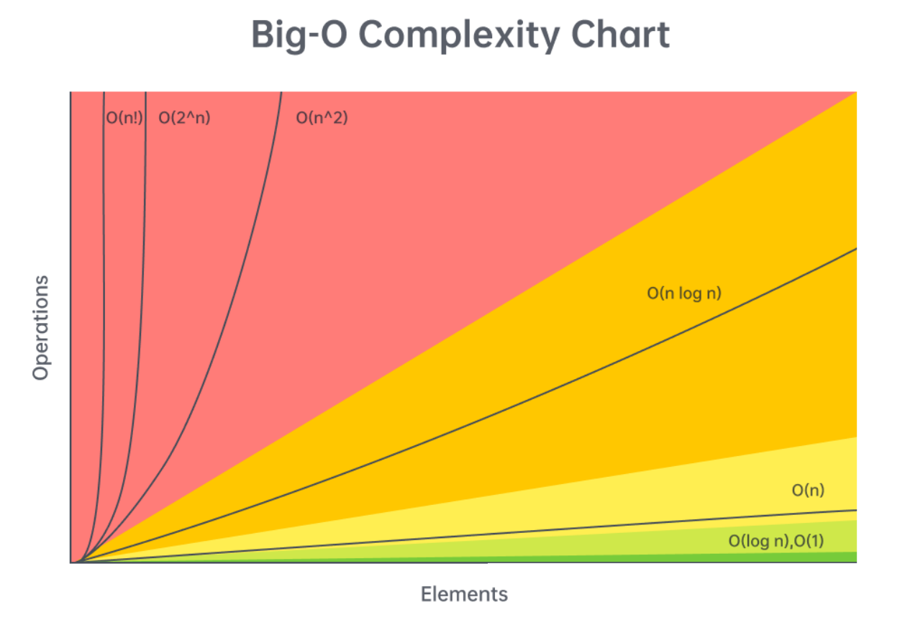
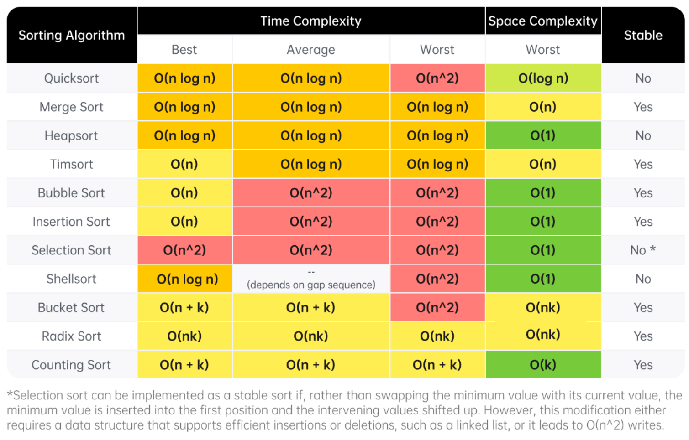
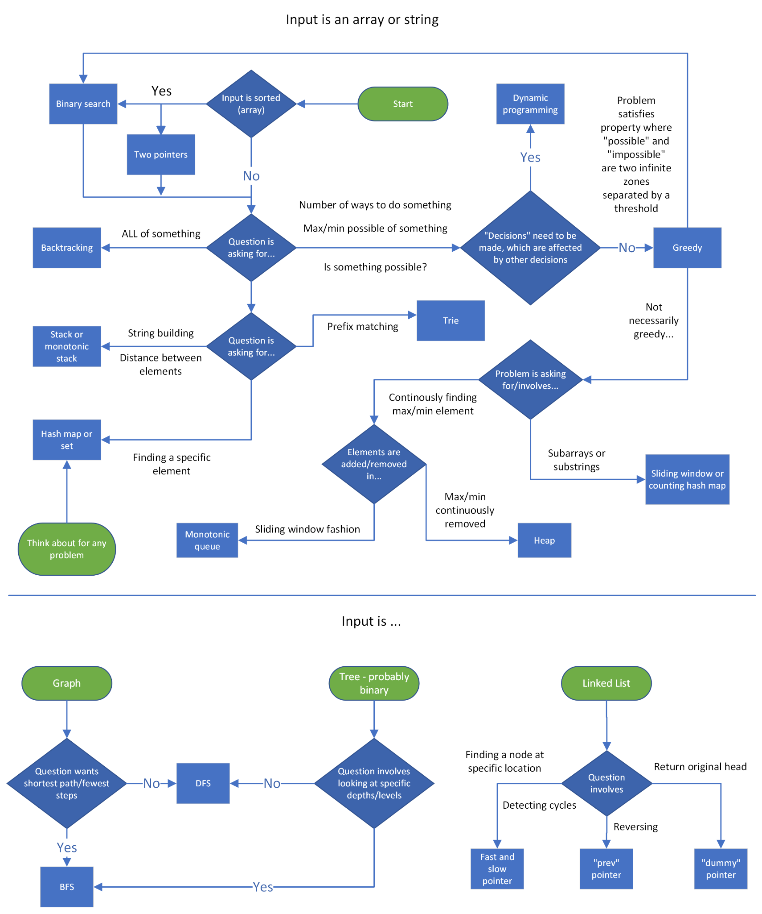

# Cheat Sheet 
*This article will be a collection of cheat sheets that you can use as you solve problems and prepare for interviews. You will find:

Time complexity (Big O) cheat sheet
General DS/A flowchart (when to use each DS/A)
Stages of an interview cheat sheet*

---

#  Big-O Complexity Overview

Understanding time and space complexity is foundational to solving algorithmic interview problems.

# Time Complexity Cheat Sheet

First, let's talk about the time complexity of common operations, split by data structure/algorithm. Then, we'll talk about reasonable complexities given input sizes.

---

## 📌 Arrays (Dynamic Array/List)

Given **n = arr.length**

| Operation | Time Complexity |
|----------|-----------------|
| Add/remove at end | **O(1)** amortized |
| Add/remove at arbitrary index | **O(n)** |
| Access/modify element | **O(1)** |
| Check if element exists | **O(n)** |
| Two pointers | **O(n · k)** |
| Build prefix sum | **O(n)** |
| Subarray sum (with prefix sum) | **O(1)** |

---

## 📌 Strings (Immutable)

Given **n = s.length**

| Operation | Time Complexity |
|----------|-----------------|
| Add/remove character | **O(n)** |
| Access character | **O(1)** |
| String concatenation | **O(n + m)** |
| Substring creation | **O(m)** |
| Two pointers | **O(n · k)** |
| Build string (join/StringBuilder) | **O(n)** |

---

## 📌 Linked Lists

Given **n** nodes

| Operation | Time Complexity |
|----------|-----------------|
| Add/remove with pointer **before** location | **O(1)** |
| Add/remove with pointer **at** location | **O(1)** (doubly linked) |
| Add/remove without pointer | **O(n)** |
| Access arbitrary position | **O(n)** |
| Check if element exists | **O(n)** |
| Reverse between i and j | **O(j − i)** |
| Detect cycle | **O(n)** |

---

## 📌 Hash Table / Dictionary

Given **n = dic.length**

| Operation | Time Complexity |
|----------|-----------------|
| Add/remove key-value pair | **O(1)** |
| Check if key exists | **O(1)** |
| Check if value exists | **O(n)** |
| Access/modify value | **O(1)** |
| Iterate through keys/values | **O(n)** |

> ⚠️ Hashing strings costs **O(m)** where m = string length.  
> Complexity is constant *relative to n*, not input size.

---

## 📌 Set

Given **n = set.length**

| Operation | Time Complexity |
|----------|-----------------|
| Add/remove | **O(1)** |
| Check existence | **O(1)** |

---

## 📌 Stack (Array Implementation)

Given **n = stack.length**

| Operation | Time Complexity |
|----------|-----------------|
| Push | **O(1)** |
| Pop | **O(1)** |
| Peek | **O(1)** |
| Access by index | **O(1)** |
| Check if element exists | **O(n)** |

---

## 📌 Queue (Doubly Linked List Implementation)

Given **n = queue.length**

| Operation | Time Complexity |
|----------|-----------------|
| Enqueue | **O(1)** |
| Dequeue | **O(1)** |
| Peek | **O(1)** |
| Access by index | **O(n)** |
| Check existence | **O(n)** |

---

## 📌 Binary Tree Algorithms (DFS/BFS)

Given **n nodes**

Most tree traversals take:
Time Complexity:
O(n)

You visit each node exactly once.

Space Complexity:

O(h) in average case

O(n) in worst case (skewed tree)

Where h = height of the tree.

So:

Balanced tree → space = O(log n)

Skewed tree → space = O(n)

---

#  Sorting Algorithm Complexities

A useful reference for comparing popular sorting algorithms in coding interviews.

---

#  Algorithm Decision Flowchart  
Use this when you're stuck deciding **which technique** to apply for a problem.

---

